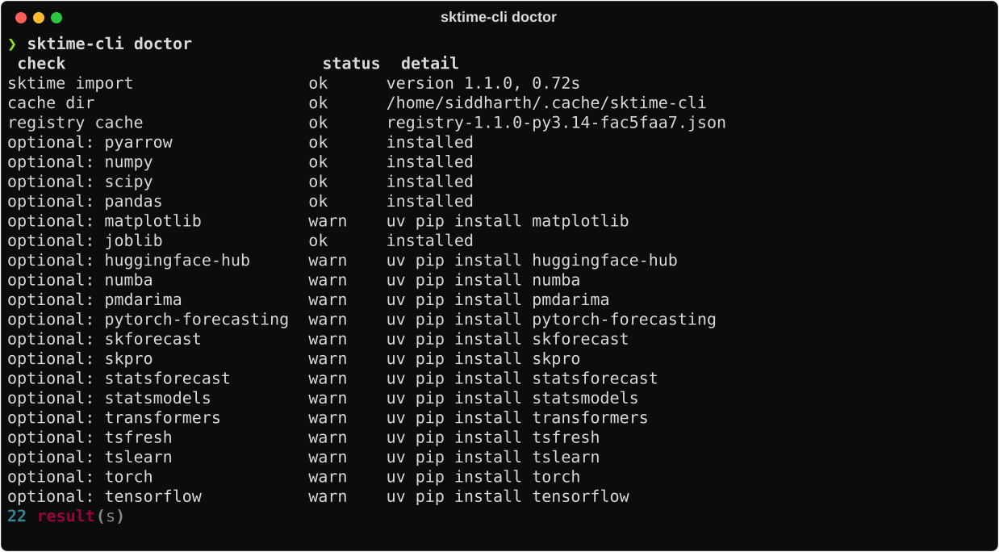
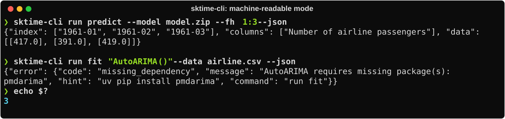

<div align="center">

# sktime-cli

**The command line for [sktime](https://github.com/sktime/sktime) — built for AI agents and humans.**

Discover estimators, fetch datasets, inspect time series files, and run
fit / predict / evaluate workflows straight from your shell.


[](https://github.com/astral-sh/ruff)
[](https://github.com/sktime/sktime)



</div>

---

## Highlights

- **Stateless, one-shot commands** — every invocation is a single process:
  read files, call sktime, write results, exit with a meaningful code.
  State lives on disk only, Hugging Face CLI style.
- **Registry-native discovery** — `registry search` filters sktime's full
  estimator registry by scitype and capability tags, served from a disk cache
  so warm searches are instant.
- **Estimator spec strings** — models are named the way you'd write them in
  Python: `"NaiveForecaster(sp=12)"`, with pipelines via `*`, ensembles via
  `+`, and multiplexers via `|`.
- **Any format in, any format out** — csv, parquet, json, `.ts`, `.tsf`,
  `.arff`; every command speaks `--format human|agent|json|quiet`.
- **Agent-first contract** — one JSON document on stdout, structured errors
  on stderr, stable exit codes, and a ready-to-drop-in
  [agent skill](skills/sktime-cli/SKILL.md).

## Installation

```bash
uv tool install sktime-cli   # or: pip install sktime-cli
```

Verify your setup and see which optional dependencies are available:

```bash
sktime-cli doctor
```

<div align="center">

</div>

## Quickstart

```bash
# what can I use?
sktime-cli registry search forecaster -t capability:missing_values=true
sktime-cli registry describe NaiveForecaster

# get data
sktime-cli datasets load airline --output airline.csv
sktime-cli data inspect airline.csv

# fit, predict, evaluate — estimators are given as sktime spec strings
sktime-cli run fit "NaiveForecaster(sp=12)" --data airline.csv --model-out model.zip
sktime-cli run predict --model model.zip --fh 1:12
sktime-cli run evaluate "NaiveForecaster(sp=12)" --data airline.csv --fh 1:12 \
  --metric MeanAbsolutePercentageError
```

## Command overview

| Group | Commands | What it does |
|---|---|---|
| `registry` | `search` · `describe` · `tags` · `types` | Discover sktime estimators by scitype, name, and capability tags |
| `datasets` | `list` · `describe` · `load` | Browse and fetch built-in, UCR/UEA, Monash, and fpp3 datasets |
| `data` | `inspect` · `convert` · `split` | Detect mtypes/scitypes, convert formats, temporal train/test split |
| `run` | `fit` · `predict` · `fit-predict` · `evaluate` | One-shot workflows for forecasting and classification |
| `model` | `inspect` | Look inside a saved model artifact; round-trip its spec |
| *(top level)* | `version` · `env` · `doctor` · `cache` | Environment info, health check, workspace management |

See the [CLI reference](docs/cli-reference.md) for every option.

## Built for AI agents

`sktime-cli` treats agents as first-class users. Add `--json` to any command
and you get exactly one parseable JSON document on stdout; errors are JSON on
stderr with stable codes and actionable hints.

<div align="center">

</div>

| exit | meaning |
|---|---|
| `0` | success |
| `1` | library or unexpected failure |
| `2` | usage error |
| `3` | missing optional dependency (the hint says what to install) |
| `4` | estimator / dataset / model not found |
| `5` | data validation or spec error |

The full agent-facing contract and task-oriented workflows live in
[skills/sktime-cli/SKILL.md](skills/sktime-cli/SKILL.md) — drop the `skills/`
folder into your agent's skill directory (e.g. `.claude/skills/`) and your
agent knows how to drive the CLI. The same file ships inside the wheel.

## Documentation

| Document | Contents |
|---|---|
| [Architecture](docs/architecture.md) | Repository layout, module map, dependency layering, data flow |
| [Design](docs/design.md) | Design decisions: state model, output contract, error model, spec engine, caching |
| [CLI reference](docs/cli-reference.md) | Full command tree with options |
| [Agent skill](skills/sktime-cli/SKILL.md) | The contract agents are given |
| [Plan](PLAN.md) | v0.0.1 milestones and roadmap |

## Relation to sktime-mcp

`sktime-cli` is the CLI sibling of
[sktime-mcp](https://github.com/sktime/sktime-mcp). The command vocabulary
mirrors its tool names (`registry search` ~ `query_registry`,
`registry describe` ~ `describe_component`, `run fit`/`predict`/`evaluate`),
so agent knowledge transfers between the two.

## Status

**v0.0.1 — early alpha.** Discovery and one-shot runs are complete; see
[PLAN.md](PLAN.md) for what's deferred to v0.0.2+. An adversarial agent
benchmark suite (foundation + hard tiers, provider-neutral run records,
scoring keys) is being developed on the
[`feat/adversarial-benchmark`](../../tree/feat/adversarial-benchmark) branch.

## License

[BSD 3-Clause](LICENSE), consistent with sktime.
