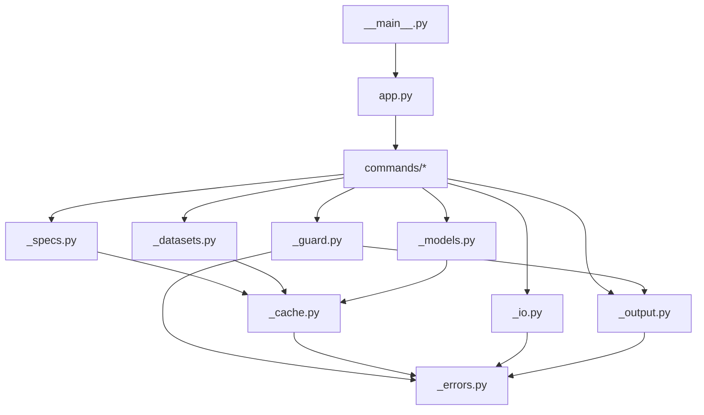

# Architecture

`sktime-cli` is a thin, stateless layer over sktime: a Typer application, six
command groups, and a set of small internal modules that each own exactly one
concern. This page maps the repository, the modules, and the path a command
takes from argv to output.

## Repository layout

```
sktime_cli/
├── pyproject.toml            # hatchling build, uv-managed, ruff config
├── src/sktime_cli/
│   ├── app.py                # Typer root: global options, command registration
│   ├── __main__.py           # `python -m sktime_cli`
│   ├── _errors.py            # CliError + error-code → exit-code table
│   ├── _guard.py             # the one exception handler; shared --format/--json options
│   ├── _output.py            # format dispatch: human/agent/json/quiet emitters
│   ├── _cache.py             # workspace dirs + registry disk cache
│   ├── _specs.py             # "NaiveForecaster(sp=12)" → estimator instance
│   ├── _io.py                # csv/parquet/json/.ts/.tsf/.arff read & write, --fh parsing
│   ├── _datasets.py          # dataset name resolution and loaders (builtin/ucr/tsf/fpp3)
│   ├── _models.py            # model .zip save/load
│   ├── .agents/skills/sktime-cli/SKILL.md   # agent-facing contract, shipped in the wheel
│   └── commands/
│       ├── registry.py       # search · describe · tags · types
│       ├── datasets.py       # list · describe · load
│       ├── data.py           # inspect · convert · split
│       ├── run.py            # fit · predict · fit-predict · evaluate
│       ├── model.py          # inspect
│       └── env.py            # version · env · doctor · cache info/clear
├── tests/                    # pytest + Typer CliRunner, network tests marked
└── docs/                     # this documentation site
    ├── conf.py               # Sphinx configuration
    ├── _ext/typer_cli.py     # generates the CLI reference from the live app
    └── assets/generate.py    # renders the terminal captures
```

## Dependency layering

Modules import strictly downwards; `_errors.py` and `_output.py` are the
leaves. There are no import cycles.



A deliberate import discipline keeps startup fast: **the only third-party
module imported at module level is `typer`**. Every sktime, pandas, numpy,
rich, and platformdirs import is function-local, so `sktime-cli --help` and
`--version` never pay sktime's import cost.

## Module responsibilities

| Module | Owns | Key entry points |
|---|---|---|
| `app.py` | Typer root, global options (`--format`, `--json`, `--cache-dir`, `--no-cache`, `--version`), command registration | `app`, `main()` |
| `_errors.py` | The error vocabulary. Codes are append-only and part of the published contract | `CliError`, `EXIT_CODES`, `missing_dependency()` |
| `_guard.py` | The single exception choke point; every leaf command is decorated with it | `handle_errors`, `FORMAT_OPT`, `JSON_OPT` |
| `_output.py` | Rendering for all five formats and the stdout/stderr split | `emit_record`, `emit_table`, `emit_frame`, `print_error`, `resolve_format` |
| `_cache.py` | Workspace resolution and the registry disk cache | `cli_home()`, `get_registry()`, `lookup()`, `import_object()` |
| `_specs.py` | Spec strings → estimator instances; `--set` overrides; metric/CV resolution | `build_estimator()`, `apply_sets()`, `resolve_metric()`, `resolve_cv()` |
| `_io.py` | File formats sktime doesn't handle itself; index conventions; `--fh` grammar | `read_any()`, `write_any()`, `parse_fh()`, `parse_size()` |
| `_datasets.py` | Dataset ID grammar (`airline`, `ucr:ArrowHead`, …) and loader normalization | `resolve()`, `load()`, `listing()`, `BUILTIN` |
| `_models.py` | Model artifact `.zip` in/out | `save_model()`, `load_model()`, `estimator_scitype()` |
| `commands/*` | Option surfaces and orchestration only, no domain logic | one `typer.Typer` per group |

## The life of a command

Taking `sktime-cli run fit "NaiveForecaster(sp=12)" --data airline.csv
--model-out model.zip` as the example:

1. **Root callback** (`app.py:_root`) stores the global `--format`/`--json`
   choice in `_output` and the cache flags in `_cache`. Global state is fine
   here because every invocation is one short-lived process.
2. **Guard**: the leaf command is wrapped by `_guard.handle_errors`, so from
   this point every failure becomes a structured error on stderr plus a
   meaningful exit code (see [the error model in Design](design.md#error-model)).
3. **Spec engine**: `_specs.build_estimator` parses the spec with `ast`,
   resolves `NaiveForecaster` against the cached registry, imports just that
   module, and evaluates the expression in a builtins-free namespace.
4. **Data loading**: `run._load_input` treats `--data` polymorphically: an
   existing path is read via `_io.read_any` (index conventions applied),
   anything else resolves as a dataset name via `_datasets.resolve`.
5. **Fit dispatch**: forecasters get `fit(y, X, fh)`; panel scitypes
   (classifier/regressor/clusterer) get `fit(X, y)`.
6. **Artifact**: `_models.save_model` writes the `.zip` (defaulting into the
   workspace `models/` dir when `--model-out` is omitted).
7. **Output**: a result record goes through `_output.emit_record` in
   whichever format was resolved: rich table (human), TSV (agent), one JSON
   document (json), or just the essential value (quiet).

## Testing

Tests run the CLI in-process through `typer.testing.CliRunner` (`invoke`
fixture in `tests/conftest.py`). A session-scoped autouse fixture points
`SKTIME_CLI_HOME` at a temp directory, so tests never touch the real cache.
This works because `_cache.cli_home()` reads the environment at call time,
not import time. Tests that download data are marked `network` and excluded
by default (`addopts = "-m 'not network'"` in `pyproject.toml`).
